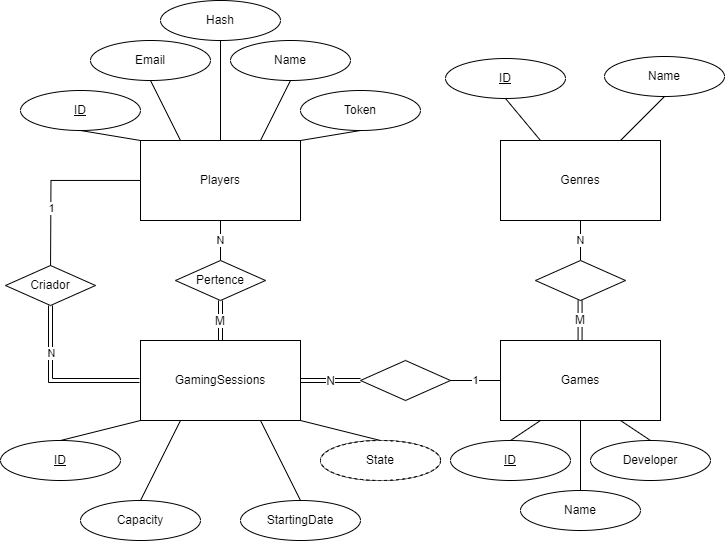

# Grupo - 10 / LEIC 41 - D
- Rodrigo Meneses - 50542
- Rafael Nicolau - 50546
- Mário Carvalho - 50561

## Final Report 

### Introduction

This document contains the relevant design and implementation aspects of LS project's last phase.

## Modeling the database

#### Conceptual model

The following diagram holds the Entity-Relationship model for the information managed by the system.

We highlight the following aspects:
-  Our module does not use a different entity for developer since all that it does can be done with a simple attribute.
-  Since a game can have a multitude of genres we opted to create that entity (genre) to simplify the code.

The conceptual model has the following restrictions:
- Player's email and token as AK.
- Game's name as AK.
- Genre's name as AK.
- GamingSession's date can´t be inserted with a date newer than the current date.
- Capacity must be higher than 0.

#### Physical Model

The physical model of the database is available in [link to the SQL script with the schema definition](src/main/sql/createSchema.sql).

We highlight the following aspects of this model:
- Gaming Session state is defined as true if the date is newer than the current date.

## Software organization

#### Open-API Specification

[Open-API Specification YAML file](docs/API-docs%201.0.yaml)

In our Open-API specification, we highlight the following aspects:
- All the possible routes you can do as a user
- The correct way to send requests to our server
- Possible errors you could have sending a request and fixes
- Auxiliary images to show an example request

#### Request Details

To help visualize our implementation of the request schemes we made this diagram

All requests are received in the server file that divides all requests by its own URL path to the corresponding API section. All those sections correlate to the corresponding entity that is being used at the moment.
For example, if I want to create a new player it would send that request to the player's API file.

In the API section we extract all the information that the user sent us and by giving it to the Services section.
The information that we send to services could be in authorization(bearer token), body, query, path...
It's in this section where we send all the HTTP responses and catch even the responses.
We can then return a response according to the return of the services

In the Services section where we turn all the information received by the API to the corresponding object by using.
It's also here where we check if the user is authenticated with a bearer token that fits with a player in our database.
Also, we check here if the parameters that are sent are valid according to the request made.
We also send most of our Exceptions here so that the API can catch them and turn them into HTTP error responses.
It's here where we apply all the logic and send the objects to the Data section.

In the Data section we modify the data according to the corresponding request unless the request is invalid in some sense that could end up causing some cause of exceptions for example if u try to create a player with the same email it will cause an exception(because the email is unique)

We also created an inline function in Response.json(body: T) so that the content type would always be JSON in the responses

### Server --> API --> Services --> Data

#### Connection Management

To make sure that everything is stable we created all the sections independently to one another.
What we mean is that to create the API class you need to send the as an argument class of services that is going to be connected and to create the Services class you need to send the db that is going to be affected by the requests.
We create the db that is going to be used in the server file and then we connect to all the sections that are going to be used in these lines "val db = DataMem() /n val api = API(Services(db))"  then in all the possible routes we call the corresponding functions to this api object.

Connections to the RDBMS are vital for database interactions in our project. Following best practices, we obtain Connection instances through the DataSource interface, enabling efficient connection pooling. Once acquired, a Connection instance encapsulates transactional scopes, ensuring data integrity. Our conn() function exemplifies this, where we configure and manage connections for manual transaction control. Additionally, our useWithRollback extension function handles transactional logic, including proper commit, rollback, and connection closure, promoting robust and efficient database interactions. Overall, our approach emphasizes resource management, transactional integrity, and performance optimization, facilitating reliable database operations within our application.
#### Data Access

To help with visualizing our module we created this image that resumes our interface for Data Acess.

To help in Data access we created an Interface Storage that contains each Interface storage  (players, gamingSessions, games).
Now as we can see in this image this Interface is used to help define each class in memory or Postgres. That has its own player, gaming sessions, and game classes associated with it.
This way we can confirm that each DB uses all the functions defined in the Interface Storage.

The email attribute defined in the createSchema.sql file ensures data integrity and uniqueness within the database. It specifies that the email field is of type varchar(50), allowing for a maximum length of 50 characters. The NOT NULL constraint ensures that every record must have a value for the email field.

Furthermore, the CHECK constraint utilizes a regular expression pattern to validate that the email values adhere to the typical format of email addresses encountered in daily usage, such as "local-part@domain.TLD". This pattern ensures that the entered email addresses are in a recognizable and standardized format.

Additionally, the UNIQUE constraint guarantees that each email address stored in the database is unique, preventing duplicate entries and maintaining data integrity.

#### Error Handling/Processing

For error handling, we opted to create an inline function that uses try and catch for each function in the API section and whenever there is an error of some kind we send out an exception that is translated to a response (via our function httpException(e)) with the corresponding HTTP error status for each different exception.
For some errors, we even created new exceptions to correlate to a different HTTP error status.

## Deployment

We have successfully deployed our site using Rendeer and Docker. The Dockerfile used for the deployment is located in the root directory of our project. The deployment process involves building a Docker image from our Dockerfile and then deploying that image using Rendeer.

### Docker

Docker is a platform that allows us to automate the deployment, scaling, and management of applications. It uses containerization technology to package up an application with all of its dependencies into a standardized unit for software development.

### Password Encryption

We use bcrypt for password encryption. When a player creates an account or changes their password, we hash the password using bcrypt and store the hash in our database. The `Password` class ensures that passwords meet strength requirements.

During login, the entered password is hashed and compared with the stored hash. If they match, access is granted. This method ensures that even if our database is compromised, the actual passwords remain secure.

Bcrypt is a one-way hash function, making it computationally infeasible to reverse the process and obtain the original password from the hash.

#### Critical Evaluation

All proposed tasks have been successfully executed by the group. Moving forward, there is a focus on optimizing the management of our project's file structure, improving the clarity of file and function naming, and enhancing the frequency of updates to our project reports.
For the near future we are expecting to create some neat features like a logger.
